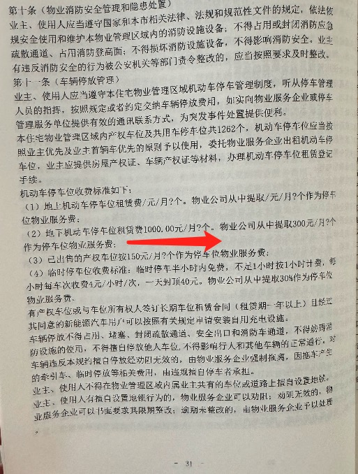
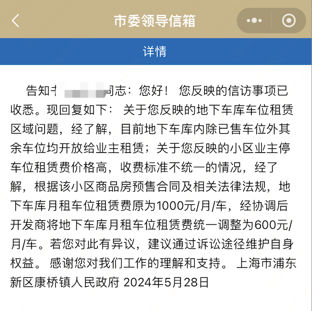

上海市浦东新区新楼盘壹府澜庭交房、入住历程。
## 时间线
1，签预售合同日：2021年06月09日。各种格式条款、无法更改，存在多个版本，关键信息使用?替代，存在诸多误解。

2，交房日：2023年06月底

3，第一次通知收停车租赁费1000元/月：2023年10月22日

4，业务与开发商、派出所、物业第一次协商，无达成费用一致协议

5，第二次通知收停车租赁费600元/月，且同小区公寓车租赁费400元/月，价格存在歧视差异：2024年05月11日

6，业务与开发商、派出所、物业第二次协商，无达成费用一致协议；

### 霸道霸气护航高价停车租赁费
1，单方面定价1000元/月或600元/月，强制业主必须马上无条件接受，否则限制出行，到场民警强制业主必须马上立刻缴纳不合理、未协商一致、未认可的费用，否则带回派出所调解或倒回车库（大量现场视频证据、以及向督查举报线索）；

2，私自更改合同（存在？的描述，单方面认定1000元/1月），强制业主必须无条件马上立刻接受；康桥镇政府人员在大量反馈后，电话通知业主必须无条件认可未达成一致的调解费用600元/1月，对合同中存在？的描述、以及开发商私自更改的违法行为，采取漠视、不处罚、不整治的态度，单方面施压业主接受开发商认定通知的价格。

### 开发商第一次起诉业主占用车位：2024年06月12日

## 官方反馈渠道回复
1，认为备案合理、高价合理，康桥镇作为楼盘投资关联一方，对提交的文件进行盖章认可，存在涉嫌利益输送的问题，

2，合同条款建议司法途径，回复有争议的条款让业主走司法途径解决。未做到本质工作尽责，详见后续国家政策、国家法律，作为监管部门有法不依、有规不遵、有责不担，致使群众利益受损、引发社会舆情（详见东方卫视的报道）

## 总结
~~~
1，开发商提交什么备案、什么数字，都认为是合理的，准予盖章，有问题建议向上级反馈（哪个上级永远无法得知）；
2，合同条款只对业主具有约束力，开发商随意更改都是有效的；
3，违背市场定价、超出周边3-4倍，是一个合理且合法的价格，消费者保护法、市场监督职责纯粹是儿戏；
4，私改合同、单方面强制定价，为何开发商不用走司法途径确定有效？而认为无效需要业主走司法途径认为无效？法律意义何在？
~~~
### 开发商与政府涉嫌存在利益关联
壹府澜庭小区所属开发商：上海中建康桥投资发展有限公司，从股权投资比例看，上海市浦东新区康桥镇政府是投资关联方。因此，投诉反馈的回复以及所谓的政府文件备案，涉及存在利益关联。

## 国家政策和法律法规

### [建]2018年58号文件[https://www.gov.cn/zhengce/zhengceku/2018-12/31/content_5433594.htm]
~~~
  4.利用合同格式条款，免除自身法定义务、加重购房人责任、排除购房人合法权利。
   
上海是第一批试点名单；涉及公安部、司法部、住建委、市场监督管理局等；
   （三）营造良好舆论环境。各级住房城乡建设部门牵头建立专项行动信息发布机制，各级工商、物价、公安、银监、保监、司法、宣传等部门积极配合，通过报纸、广播、电视、网站、新媒体等加强政策解读，正面引导舆论，通过定期集中曝光违法违规典型案例，形成震慑，为房地产市场营造良好舆论环境。
   （四）强化督查问责机制。对专项行动实施过程中发现的违法违规行为，要依法从严惩处。对开展整治行动不力、人民群众投诉较多、房地产市场违法违规行为较严重的地方，要加大督查力度。对涉嫌隐瞒包庇、滥用职权、玩忽职守的部门和人员，要坚决问责。
   （五）建立监管长效机制。要坚持整顿规范与制度建设并重、专项整治与日常监督并重、加强管理与改善服务并重、投诉受理与主动监管并重，逐步建立健全房地产行业信用体系，积极推进房地产领域守信联合激励和失信联合惩戒机制建设。
~~~
### 消费者保护法
~~~
第十六条【经营者履行法定义务和约定义务】经营者向消费者提供商品或者服务，应当依照本法和其他有关法律、法规的规定履行义务。
经营者和消费者有约定的，应当按照约定履行义务，但双方的约定不得违背法律、法规的规定。
经营者向消费者提供商品或者服务，应当恪守社会公德，诚信经营，保障消费者的合法权益；不得设定不公平、不合理的交易条件，不得强制交易。
第二十六条【正确使用格式条款的义务】经营者在经营活动中使用格式条款的，应当以显著方式提请消费者注意商品或者服务的数量和质量、价款或者费用、履行期限和方式、安全注意事项和风险警示、售后服务、民事责任等与消费者有重大利害关系的内容，并按照消费者的要求予以说明。
经营者不得以格式条款、通知、声明、店堂告示等方式，作出排除或者限制消费者权利、减轻或者免除经营者责任、加重消费者责任等对消费者不公平、不合理的规定，不得利用格式条款并借助技术手段强制交易。
格式条款、通知、声明、店堂告示等含有前款所列内容的，其内容无效。
第五十一条【精神损害赔偿责任】经营者有侮辱诽谤、搜查身体、侵犯人身自由等侵害消费者或者其他受害人人身权益的行为，造成严重精神损害的，受害人可以要求精神损害赔偿。
第五十六条【经营者的行政责任】经营者有下列情形之一，除承担相应的民事责任外，其他有关法律、法规对处罚机关和处罚方式有规定的，依照法律、法规的规定执行；法律、法规未作规定的，由工商行政管理部门或者其他有关行政部门责令改正，可以根据情节单处或者并处警告、没收违法所得、处以违法所得一倍以上十倍以下的罚款，没有违法所得的，处以五十万元以下的罚款；情节严重的，责令停业整顿、吊销营业执照：
（一）提供的商品或者服务不符合保障人身、财产安全要求的；
（二）在商品中掺杂、掺假，以假充真，以次充好，或者以不合格商品冒充合格商品的；
（三）生产国家明令淘汰的商品或者销售失效、变质的商品的；
（四）伪造商品的产地，伪造或者冒用他人的厂名、厂址，篡改生产日期，伪造或者冒用认证标志等质量标志的；
（五）销售的商品应当检验、检疫而未检验、检疫或者伪造检验、检疫结果的；
（六）【对商品或者服务作虚假或者引人误解的宣传的；】
（七）拒绝或者拖延有关行政部门责令对缺陷商品或者服务采取停止销售、警示、召回、无害化处理、销毁、停止生产或者服务等措施的；
（八）对消费者提出的修理、重作、更换、退货、补足商品数量、退还货款和服务费用或者赔偿损失的要求，故意拖延或者无理拒绝的；
（九）侵害消费者人格尊严、侵犯消费者人身自由或者侵害消费者个人信息依法得到保护的权利的；
（十）法律、法规规定的对损害消费者权益应当予以处罚的其他情形。
经营者有前款规定情形的，除依照法律、法规规定予以处罚外，处罚机关应当记入信用档案，向社会公布。
~~~
### 消费者保护法条例[https://www.gov.cn/zhengce/zhengceku/202403/content_6940159.htm]
~~~
第十七条　经营者使用格式条款的，应当遵守消费者权益保护法第二十六条的规定。经营者不得利用格式条款不合理地免除或者减轻其责任、加重消费者的责任或者限制消费者依法变更或者解除合同、选择诉讼或者仲裁解决消费争议、选择其他经营者的商品或者服务等权利。
第二十二条　经营者以收取预付款方式提供商品或者服务的，应当与消费者订立书面合同，约定商品或者服务的具体内容、价款或者费用、预付款退还方式、违约责任等事项。
经营者收取预付款后，应当按照与消费者的约定提供商品或者服务，不得降低商品或者服务质量，不得任意加价。经营者未按照约定提供商品或者服务的，应当按照消费者的要求履行约定或者退还预付款。
经营者出现重大经营风险，有可能影响经营者按照合同约定或者交易习惯正常提供商品或者服务的，应当停止收取预付款。经营者决定停业或者迁移服务场所的，应当提前告知消费者，并履行本条例第二十一条规定的义务。消费者依照国家有关规定或者合同约定，有权要求经营者继续履行提供商品或者服务的义务，或者要求退还未消费的预付款余额。
第二十八条　市场监督管理部门和其他有关行政部门应当加强消费者权益保护工作的协同配合和信息共享，依照法律、法规的规定，在各自的职责范围内，对经营者提供的商品和服务实施抽查检验等监管措施，及时查处侵害消费者合法权益的行为。
第二十九条　市场监督管理部门和其他有关行政部门应当加强消费领域信用体系建设，依法公示有关行政许可、行政处罚、抽查检验结果、消费投诉等信息，依法对违法失信经营者实施惩戒。
第五十条　经营者违反本条例第十条至第十四条、第十六条、第十七条、第十九条至第二十一条规定，其他有关法律、法规对处罚机关和处罚方式有规定的，依照法律、法规的规定执行；法律、法规未作规定的，由市场监督管理部门或者其他有关行政部门责令改正，可以根据情节单处或者并处警告、没收违法所得、处以违法所得1倍以上5倍以下的罚款，没有违法所得的，处以30万元以下的罚款；情节严重的，责令停业整顿、吊销营业执照。
经营者违反本条例第二十二条规定的，由有关行政部门责令改正，可以根据情节单处或者并处警告、没收违法所得、处以违法所得1倍以上10倍以下的罚款，没有违法所得的，处以50万元以下的罚款；情节严重的，责令停业整顿、吊销营业执照。
经营者违反本条例其他规定的，依照消费者权益保护法第五十六条的规定予以处罚。
~~~

### 市场监督管理局职责[https://www.samr.gov.cn/jg/index.html]
(五）负责监督管理市场秩序。依法监督管理市场交易、网络商品交易及有关服务的行为。组织指导查处价格收费违法违规、不正当竞争、违法直销、传销、侵犯商标专利知识产权和制售假冒伪劣行为。指导广告业发展，监督管理广告活动。指导查处无照生产经营和相关无证生产经营行为。指导中国消费者协会开展消费维权工作。
